# О проекте клона совместимого компьютера с Apple IIe
Целью данного проекта является создание платы совместимого компьютера с Apple IIe с приближенной к оригиналу схемотехникой и размером платы. За референс при разработке была взята фотография материской платы Apple IIe NTSC (она справа)
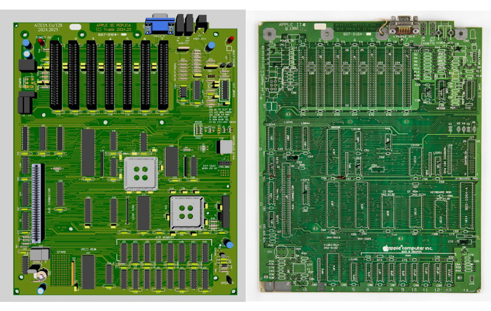
Основные отличия от оригинальной схемы:
- вместо заказных ASIC (БМК) микросхем IOU и MMU в проекте используются CPLD фирмы Altera EPM7128SLC84;
- прямо на основную плату добавлены дополнительные 64Кб памяти, известные как Aux RAM/[Apple 80-Column Text Card](https://en.wikipedia.org/wiki/Apple_80-Column_Text_Card "Apple 80-Column Text Card");
- вместо двух микросхем типа 27C64 с основным ROM Apple IIe установлена одна микросхема типа 27C256, с возможность переключить верхний и нижний банк джампером. Это позволяет записать в одну микросхему ROM AppleIIe enhanced и тест оперативной памяти DeadTest, или записать обычный Apple IIe ROM и Apple IIe enhanced с возможность переключаться между ними; 
- на плате отсутствует какой-либо контроллер клавиатуры (в следствии отсутствия свободного места). Вместо этого предусмотрено место для установки разъема, в который сверху устанавливается дополнительная плата контроллера клавиатуры "бутербродом". На дополнительной плате клавиатурного контроллера располагается разъем для подключения оригинальной матричной клавиатуры Apple IIe;
- на плате присутствует разъем PS/2 для подключения PS/2 клавиатуры, однако без дополнительной платы клавиатурного контроллера он никуда не подключен;
- основной генератор переделан с транзисторной схемы на схему с использованием инвертера типа 74LS04 (555ЛН1), при этом предусмотрена возможность установить отдельный кварцевый генератор;
- операционный усилитель в схеме работы с магнитофоном заменен с двуполярного на однополярный, тем самым обеспечивая нормальное функционирование платы от однополярного источника питания плюс 5 вольт.

## Текущий статус проекта
Общий вид собранной платы rev1.0b:
  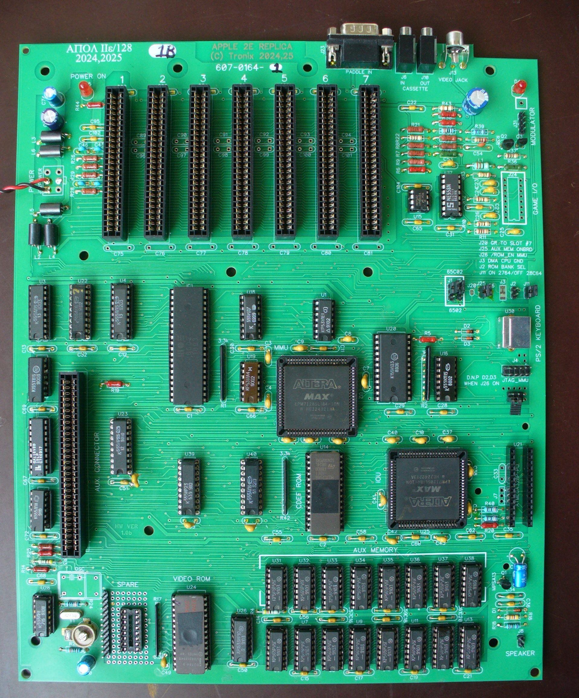 
- [x] Плата запускается, проходит тесты (RAM deadtest, встроенный в Apple IIe ROM), выводит приглашение "Apple //e";
- [x] Плата работает со слотами, с дополнительными платами расширения [Dan II controller](https://github.com/profdc9/Apple2Card), [A2VGA+Mockingboard card](https://github.com/Tronix286/a2vga_audio);  
    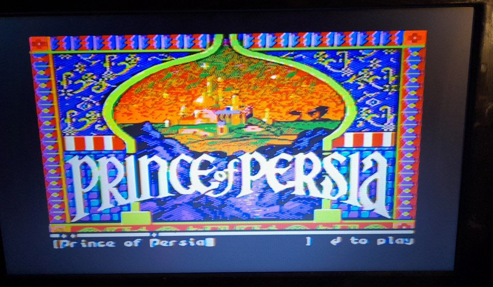</img> 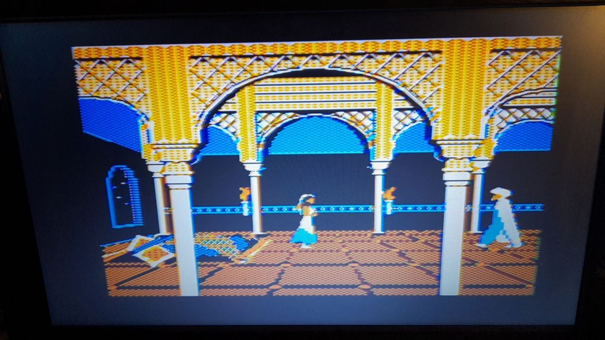</img> 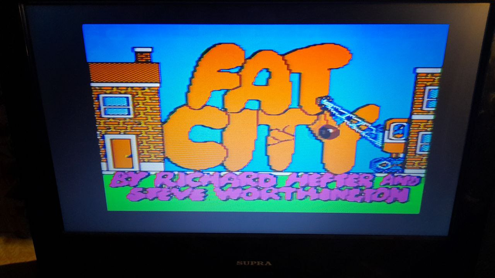</img> 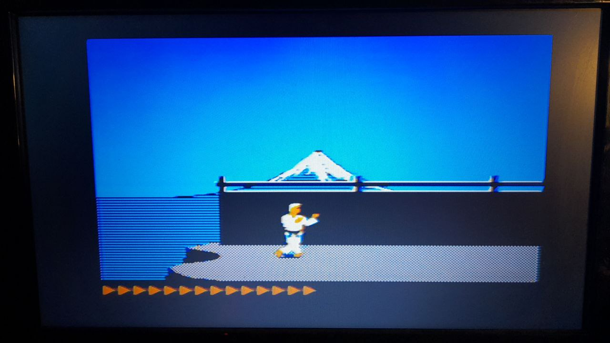</img> 
  - [ ] Проверить с другими картами расширений (пока отсутствуют);
- [X] Спикер (бипер) - работает;
- [X] Магнитифон
  - [X] Работает чтение с магнитофона, происходит загрузка игр по команде LOAD;
  - [ ] Проверить выход на магнитофон;
- [ ] Джойстик;
- [ ] Контроллер клавиатуры (в разработке);
  - [X] Обслуживание PS/2 клавиатуры;
  - [X] Обслуживание оригинальной матричной клавиатуры;
  - [X] Одновременное обслуживание обоих видов клавиатур;
  - [X] Создание схемы в CAD;
  - [X] Чертеж и заказ печатных плат; 
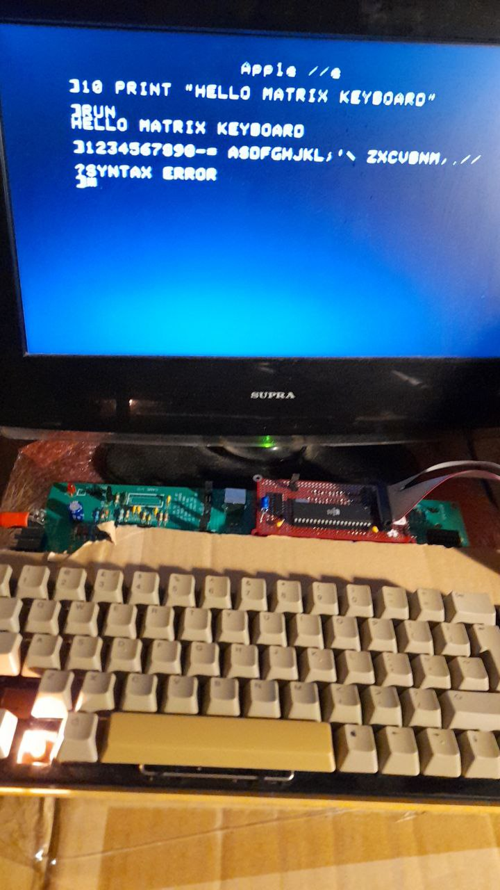</img> 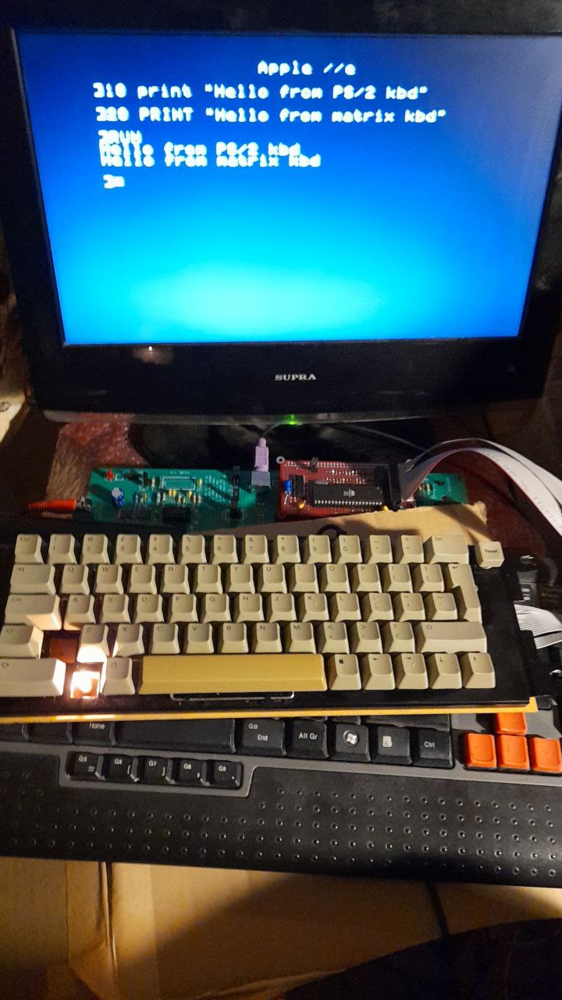</img> 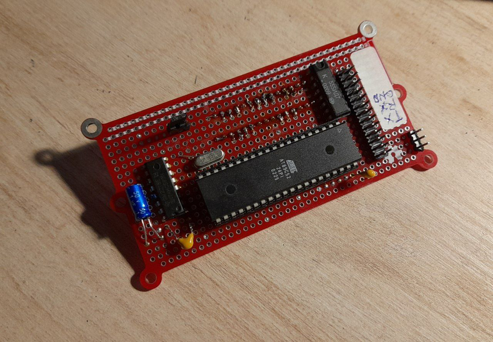</img> 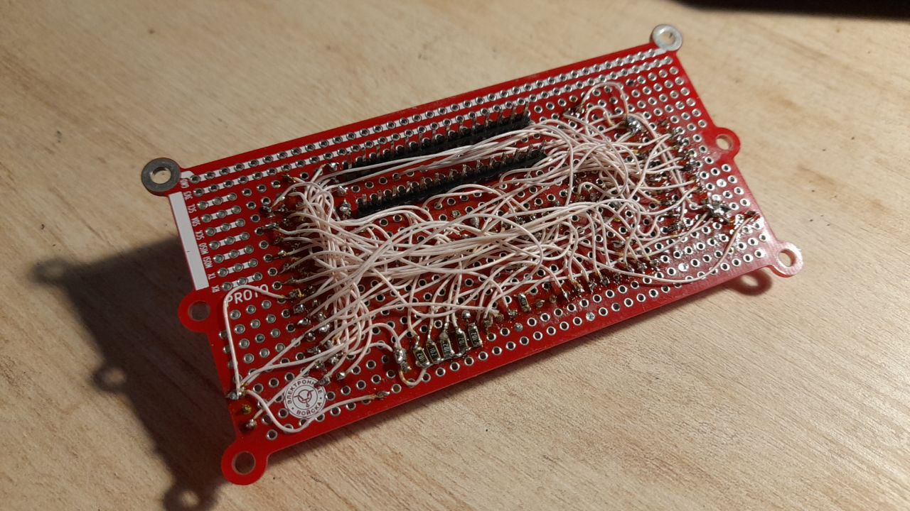</img> 
      
## Сборка платы
### Какая документация нужна для сборки
- При разработке платы я руководствовался свеже-отрисованной схемой [Apple IIe (NTSC) - 050-0051-D](https://github.com/baldengineer/bit-preserve/blob/main/Apple/Apple%20IIe/Apple%20IIe%20(NTSC)%20-%20050-0051-D/Apple%20IIe%20(NTSC)%20-%20050-0051-D.pdf "Apple IIe (NTSC) - 050-0051-D") от команды [bit-preserve](https://github.com/baldengineer/bit-preserve/tree/main/Apple/Apple%20IIe "bit-preserve") . Схема хорошо читается (в отличии от моей), полезно иметь ее под рукой для представления об оригинальной схемотехнике Apple IIe (а мы от нее не далеко отступаем).
- Список деталей BOM на плату rev1.0b здесь: [.csv версия](pdfs/bom_rev1_0b.csv) [.ods OpenOffice версия](pdfs/bom_rev1_0b.ods)
- Монтажная схема расположения деталей на плату rev1.0b здесь: [монтажная схема rev1.0b](images/pcb_montag_rev1_0b.png)
- Схема принципиальная на плату rev1.0b здесь: [схема принципиальная rev1.0b](pdfs/circuit_rev1_0b.pdf)
- Книга "мурзилка" о внутреннем устройстве Apple IIe, с временными диаграммами, принципами функционирования MMU, IOU, памяти и многим другим: [Jim Sather - Understanding the Apple IIe](https://archive.org/details/Understanding_the_Apple_IIe) Если что-то пошло не так.

### Система питаний
Для полноценного функционирования платы необходим только один источник однополярного питания плюс 5 вольт. Остальные вспомогательные напряжения минус 5 вольт, минус 12 вольт, плюс 12 вольт основной платой не используются и разведены лишь на дополнительные слоты расширения (SLOT1-SLOT7). Конкретный тип используемого разъема питания в оригинальной плате AppleIIe мной не установлен, поэтому посадочное место сделано скорее под стандартный тип Molex разъема 6 пин, хотя отверстия и несколько увеличины в диаметре для возможной установки оригинального разъема (но не гарантируется). Распиновка соответствует оригинальной распиновке Apple IIe:

При этом пятивольтовая шина питания на плате разделяется на две - одна шина питает всю логику, память и вообще нижнюю часть платы. Другая же пятивольтовая шина питает слоты расширения и схему формирования видео-сигнала (видео-усилители). Так сделано в оригинальной Apple IIe, так же сделал и я. Поэтому важно при начальной сборке платы и запуске только от однополярного источника +5 вольт не забыть установить два дросселя L5 и L2 возле разъема питания для нормального функционирования обоих этих шин. Дроссели представляют из себя ферритовые бусины для гашения возможных высокочастотных помех от блока питания, и в случае современных качественных блоков питания и/или на период сборки-наладки их можно заменить на перемычки (в случае отсутствия нужных дросселей-фильтров).

### Приступая к сборке и опять про питание
Не смотря на кажущуюся простоту конструкции и небольшое количество микросхем, компьютер Apple IIe представляет из себя достаточно сложное устройство с жесткими привязками к таймингам, есть тактовые сигналы с обратной связью, что крайне затрудняет отладку "в динамике". Поэтому имеет смысл собирать плату поблочно, проверяя тот или иной узел после сборки и только после этого приступать к другому узлу. Начать следует с питания - необходимо определиться, планируется ли использования в дальнейшем каких-либо карт расширения, использующих кроме основного питания пять вольт дополнительные линии питания плюс 12 вольт, минус 12 вольт и минус пять вольт. Если планируется, то необходимо будет распаивать все дросселя-фильтры на каждые шины питаний, устанавливать все электролитические и фильтрующие конденсаторы по этим линиям. Если не планируется, то можно обойтись одним лишь однополярным блоком питания 5 вольт и не распаивать фильтрующие конденсаторы по дополнительным линиям питаний. А конкретно это дроссель L6 и керамические конденсаторы C89 - C95 (7 штук) 0.1мкФ по линии -12 вольт; дроссель L3, конденсаторы C96 - C102 (7 штук) 0.1мкФ и электролит C71 по линии -5 вольт; дроссель L4 и конденсаторы C75 - C81 (7 штук) 0.1мкФ по линии +12 вольт. Не лишним будет начать сборку именно с установки всех фильтрующих конденсаторов 0.1мкФ по линиям питания пять вольт (порядка 90 штук в общей сложности). Так как плата двухслойная без внутренних слоев питания и земли, без блокировочных конденсаторов на плате могут появляться нежелательные шумы по питанию.

### Первые шаги
После того, как на плату можно подавать питание (минимально запаяны дроссели-фильтры L5 и L2, или перемычки вместо них, и хотя-бы часть блокировочных конденсаторов 0.1uF) следующим шагом будет логичным собрать и запустить тактовый генератор. Для этого необходимо запаять микросхему U28 (К555ЛН1), резисторы R23 и R24 номиналом 330-470 ом, подстроечный конденсатор C52 типа КПК-КП и непосредственно сам кварц 14.31818MHz. После чего убедится, что на 6-ом выходе микросхемы U28 присутствует частота 14.3MHz. Вместо подстроечного конденсатора C52 можно установить обычный керамический конденсатор 5-20пФ, но в дальнейшем может потребоваться его подбор для правильных цветов на экране. В крайнем случае можно вообще шунтировать C52 перемычкой, но на экране скорее всего будет черно-белое изображение без цветовой составляющей. Далее, можно установить микросхему управляемый буффер U5 (К555ЛП8) и резистор R15 (1k). Через эту микросхему по разрешающему входу /CLKEN сигнал 14.3MHz с выхода 6 ножки U28 транслируется дальше в остальную схему. Если микросхема U5 исправна и резистор R15 установлен, то сигнал 14.3MHz должен присутствовать на 11 выводе микросхемы U5. Затем необходимо установить микросхему U29, выполняющую роль делителя основной частоты на два и на четыре. **ВНИМАНИЕ!** В rev1.0b по умолчанию микросхема U29 применена 74LS74, что не является правильным. Требуется ее замена на микросхему 74S109 с переделками, описанными ниже в разделе **Errata** . После ее установки (модифицированной микросхемы 74S109 с подогнутыми ножками) на 5 ножке должен присутствовать сигнал 7 MHz, а на 9 ножке сигнал 3.58 MHz. Если это так, то генератор основных сигналов (14.3MHz, 7MHz и 3.58MHz) у вас собран и запущен. После этого можно запаять все резисторные сборки, проверяя первый их вывод на соответствие первому выводу на монтажной схеме, так как многие разрешающие и другие сигналы подтягиваются через эти резисторные сборки к питанию. В какой последовательности собирать плату дальше - каждый решает сам, так как дальше уже становится все взаимосвязано друг с другом и одно вряд-ли будет работать без другого. Можно лишь посоветовать сперва запаять обе панельки для CPLD и прошить их, а дальше пробовать собрать "минимальную" конфигурацию, о которой ниже. 

### Прошивки CPLD, ROM
- На плате выведен JTAG-разъем J4 для прошивки только лишь одной CPLD U2 (MMU). Вторая CPLD U25 (IOU) своего разъема JTAG не имеет и не соединена с разъемом J4 в цепочку. Поэтому прошивать CPLD необходимо последовательно - сначала вставив первую CPLD в панельку U2, прошить, извлечь, далее вставить другую CPLD в панельку U2 и прошить. Либо же делать это на каком-либо внешнем устройстве/программаторе, если такой имеется в наличии. Прошиваются CPLD через стандартный программатор от Altera USB Blaster (или его клоны) в среде Quartus II начиная с версии 9.1. Распиновка разъема JTAG стандартна, изображена на картинке:   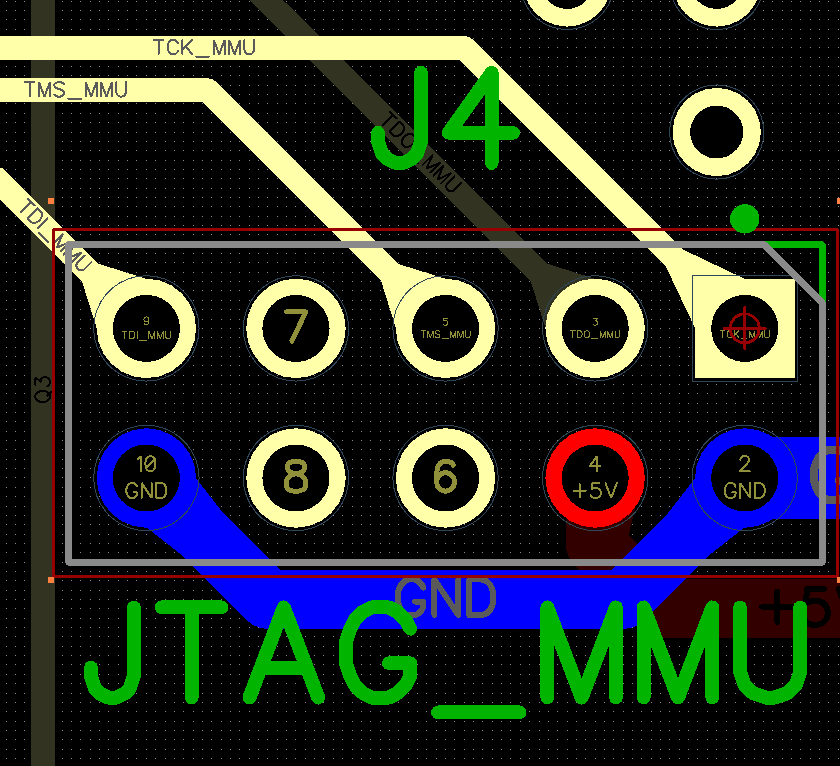 
В основе прошивок CPLD лежит открытый проект [MMU/IOU от frozen_signal](https://github.com/frozen-signal/Apple_IIe_MMU_IOU) в неизмененном виде, кроме расставленных необходимых пинов у CPLD. Готовые pof файлы для прошивки: 
[IOU здесь](firmware/IOU.pof) 
[MMU здесь](firmware/MMU.pof)

- Прошивка GAL16V8 чипа: 
[Apple IIe-IIc TMG - 341-0170-A - GAL16V8](firmware/Apple%20IIe-IIc%20TMG%20-%20341-0170-A%20-%20GAL16V8.JED)

- Прошивка основного ROM U14 (27C256) - так как применена микросхема большего размера (32Кб), чем в оригинальном AppleIIe (16Кб), на плате имеется возможность переключать верхний и нижний банк ROM **джампером J2**. Таким образом имеется возможность записать в ROM сразу две каких-либо прошивки, скомбинировав их. Например, прошика содержащая ROM от AppleIIe enhanced 1984 года и тест памяти [Apple II RAM deadtest](https://github.com/misterblack1/appleII_deadtest) или прошивка от расширенной и не расширенной версии AppleIIe. Скачать их можно здесь: 
[Apple IIe enhanced 342-0304-A-1984 + RAM deadtest](firmware/enhanced_plus_deadtest_256.bin) 
Apple IIe enhanced 342-0304-A-1984 + Apple IIe 342-0135-A-1982

- Прошивка для знакогенератора U24 (27C64/AT28C64) - Применена 8кб микросхема, поэтому имеется поддержка "двухязыковых" евро-компьютеров. Возможна установка как ПЗУ с ультрафиолетовым стиранием типа 27C64, так и электрически-стираемое ПЗУ типа AT28C64. При установке ПЗУ важно правильно выбрать тип микросхемы **джампером J11** - когда джампер снят (не установлен) то препологается что используется микросхема типа AT28C64; когда джампер установлен - микросхема типа 27C64. Скачать какую-то прошивку со шрифтами можно здесь: 
[Apple IIe Video - Custom - Enhanced-Reactive](firmware/Apple%20IIe%20Video%20-%20Custom%20-%20Enhanced-Reactive%20-%202764.bin)

Множество дампов оригинальных прошивок доступно по адресу: [https://downloads.reactivemicro.com/Apple%20II%20Items/ROM_and_JEDEC/IIe/](https://downloads.reactivemicro.com/Apple%20II%20Items/ROM_and_JEDEC/IIe/)

### Джамперы на плате
Джампер  | Назначение
------------- | -------------
J20  | Если замкнут подводит сигнал GR к 23 пину слота #7. По умолчанию разомкнут.
J25  | ON если на плате установлены дополнительные 64Кб памяти, иначе OFF. Замыкает сигнал AN3 и /FRCTXT.
J26  | Если замкнут используется логика выбора ПЗУ в MMU (не реализовано в текущей прошивке), иначе используется диодная логика. По умолчанию разомкнут.
J3   | Позволяет тактировать процессор без сигнала DMA, для отладочных нужд.
J2   | Выбор банка основного ПЗУ. Разомкнут - нижний банк, замкнут - верхний банк.
J11  | Выбор типа микросхемы ПЗУ со шрифтами. OFF микросхема типа AT28C64; ON - микросхема типа 27C64.

### "Минимальная конфигурация"
Для минимального запуска очевидно, что на плату не требуется сразу устанавливать все компоненты. На первое время можно исключить:
- Дополнительную память 64Кб AUX Ram/80 Column card. Это микросхемы памяти U31-U38 (4164/ру5), защелка U39 (74LS374), буфер U40 (74LS245), резисторная сборка R42 (3.3Kx10), резисторы R40 и R41 (47ом);
- Микросхему буфер U22 (74LS245) - она буферизирует шину данных на слоты расширения, так же участвует в опросе порта джойстика и кнопок с клавиатуры OpenApple/ClosedApple;
- Схему обработки джойстика - это таймер U17 (NE558), резисторы R10-R13 (100ом), конденсаторы C23-C26 (0.022мкФ), времязадающий конденсатор C27 (0.1мкФ);
- Схему обработки входа с магнитофона - это операционный усилитель U15 (MCP602), его обвязку резисторы R6,R7,R8,R9, конденсатор C22 (0.1мкФ);
- Схему обработки выхода на магнитофон - это резисторы R21, R22;
- Мультиплексор U16 (74LS251) - он нужен для чтения данных из порта джойстика, порта магнитофона и обработке кнопок OpenApple/ClosedApple;
- Дешифратор U20 (74LS154) - он нужен для выбора устройств в слотах расширения. При этом дешифратор U18 (74LS138) на плату все-же следует установить, так как он участвует в дешифрации адресов необходимых IOU;
- Спикер (пищалка) - это транзистор Q1 и его обвязка C34,C36,R16,R18,D1;

При такой минимальной конфигурации должна выводится картинка на экран и запускаться тест проверки памяти [Apple II RAM deadtest](https://github.com/misterblack1/appleII_deadtest) , а так же встроенный тест в основной прошивке AppleIIe, при этом приглашения с надписью Apple //e на экране не будет.  

### Запуск платы без платы клавиатурного контроллера
Клавиатурный контроллер расположен на отдельной дополнительной плате, которая устанавливается в основную плату с помощью штыревых соединителей типа PLS в посадочное место U21. В rev1.0b это посадочное место маркировано как ATMEGA328P-PU, так как предполагалось что туда можно будет установить один лишь микроконтроллер Atmega без дополнительной обвязки в виде защелки и обслуживающий только лишь PS/2 клавиатуру. В дальнейшем в ходе разработке было принято решение вместо этого вынести клавиатурный контроллер на отдельную плату, который сможет обслуживать и PS/2 и оригинальную матричную клавиатуру Apple IIe. На текущий момент плата и сам клавиатурный контроллер находятся в разработке. Но проверить и запустить основную плату можно и без контроллера клавиатуры, для этого временно:
- необходимо сигнал /RESET (6 пин U21) подтянуть 10кОм резистором к питанию (+5В);
- необходимо сигналы SW1_CAPL (12 пин U21) и SW0_OAPL (11 пин U21) замкнуть на землю. В этом случае вместо встроенного теста в основную прошивку Apple IIe компьютер будет выходить в приглашение "Apple //e"

Дальше, если есть какое-либо загрузочное устройство с автоматической загрузкой, например известный контроллер [Dan II / Apple II Storage Interface and Arduino Inteface](https://github.com/profdc9/Apple2Card) можно установить его в слот (номер 5?), после чего должна произойти загрузка заранее выбранного образа ProDOS диска. Это может быть например образ с играми [Total Replay](https://archive.org/details/TotalReplay) , который будет крутить по-кругу заставки игр.

### Видеовыход
В зависимости от параметров транзистора Q2, а так же от применимых микросхем U19 (74LS10/555ЛА4/531ЛА4) и U1 (74S02/К531ЛЕ1) сумматор синхро, видео сигнала и цветовой составляющей может нуждаться в настройке. Если на изображении присутствует "двоение", за символами тянется шлейф, то необходимо подобрать резистор R31.  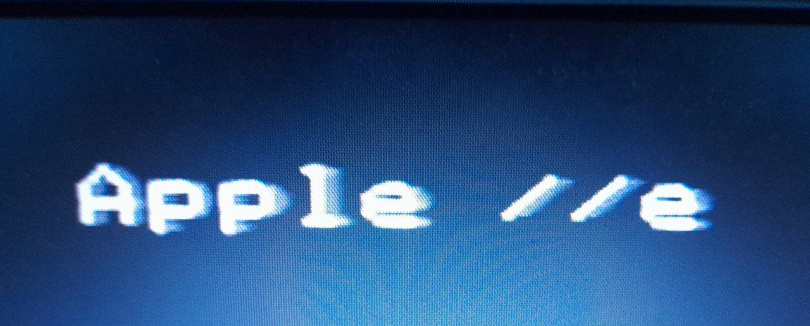</img>  
Для этого на время наладки вместо постоянного R31 6.8K впаивают переменный резистор 10K, плавной подстройкой которого добиваются отсутствия "шлейфа" за символами. Далее сопротивление переменного резистора замеряется мультиметром и на основе показаний подбирается и впаивается постоянный резистор нужного номинала. Например у меня при установленных: транзисторе Q2 КТ3107Б, U19 К531ЛА4, U1 К531ЛЕ1 сопротивление подстроечного резистора составило 456 ом, было впаяно ближайшее в ряде 470 ом, что дало приемлемый результат.  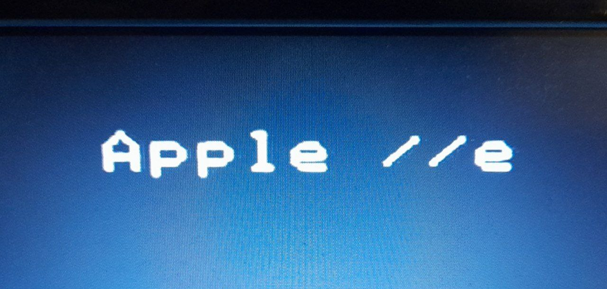</img> 

### Клавиатурный контроллер
Контроллер клавиатуры выполнен на отдельной плате, которая посредством штыревых соединителей соединяется с основной платой. За основу взят микроконтроллер Atmel AT89C52 (8051 ядро, 256 байт RAM, 8кб FLASH), как наиболее дешевый (*на момент создания клона-реплики) пяти-вольтовый МК с большим количеством выводов GPIO. Прошивка контроллера позволяет обрабатывать оригинальную матричную клавиатуру Apple 2e, PS/2 клавиатуру, а так же одновременно их обе сразу.   
Для установки дополнительной платы клавиатурного контроллера на материнской плате в посадочное место U21 впаиваются гнездовые соединители типа PBS 1x14 2.54" (мама):
 
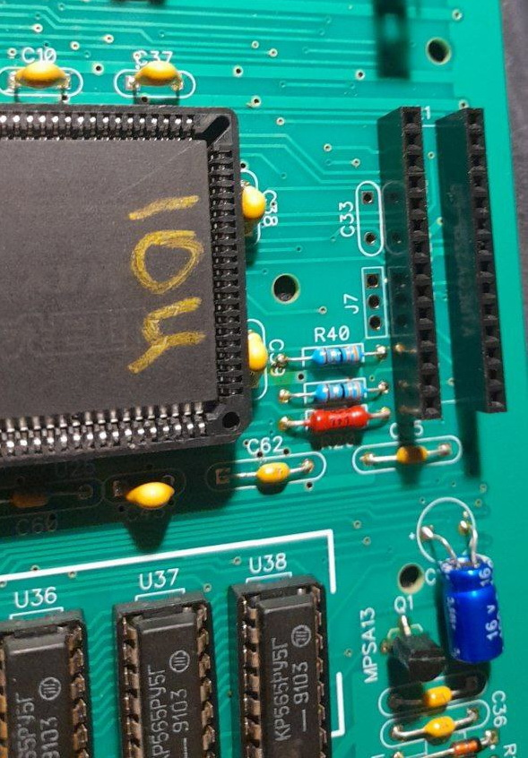 
При этом электролитический конденсатор C103 необходимо применить низко-профильный, либо расположить его горизонтально на материнской плате, что бы он не упирался в дочернюю плату клавиатурного контроллера. Компоненты C33 (0.1uF), J7 (штырки 3 пин) не устанавливаются (рудимент от идеи использовать Atmega в качестве клавиатурного контроллера). 
На плате клавиатурного контроллера с нижней стороны в разъем MB-connector впаиваются соединители типа PLS 1x14 2.54" (папа):  
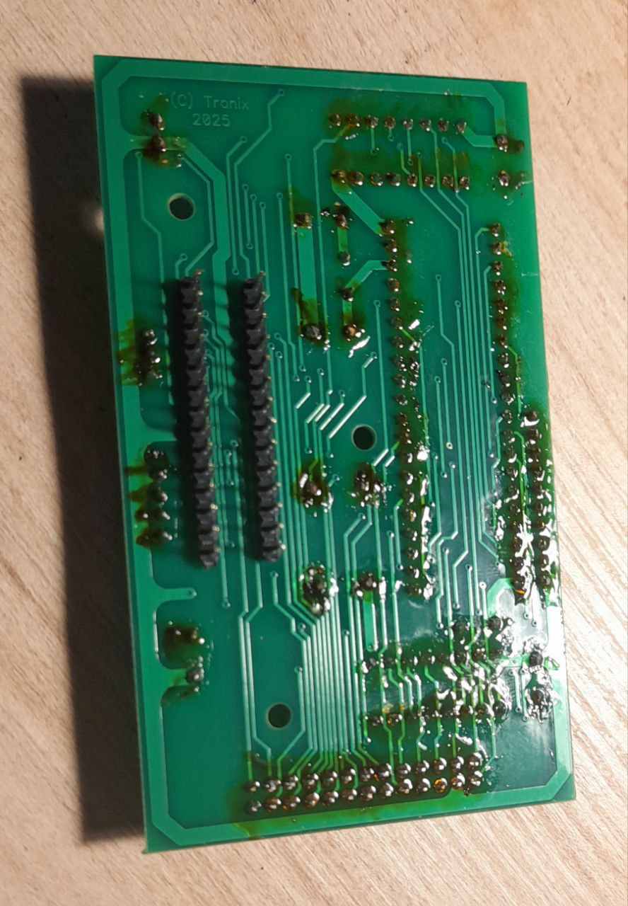 
Далее плата клавиатурного контроллера вставляется в основную плату посредством штыревых соеденителей и может быть дополнительно зафиксирована через нейлоновые стойки с помощью трех крепежных отверстий.
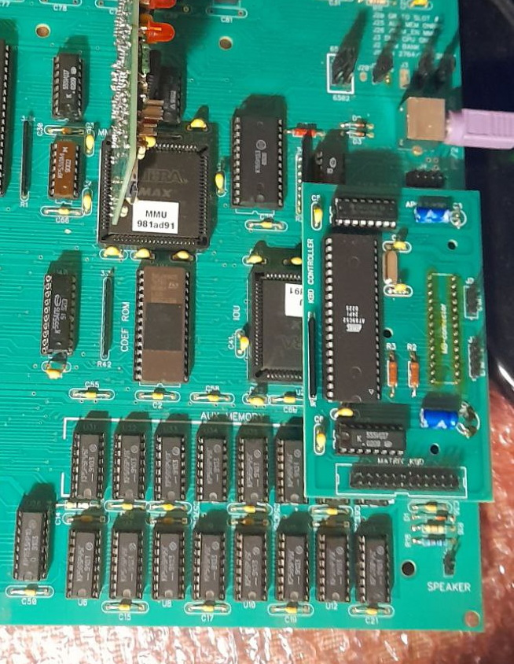

- [схема клавиатурного контроллера rev1_0b](pdfs/kbdctrl_rev1_0.pdf)
- [прошивка AT89C52 v2.58](firmware/apple_kbd.hex)

Прошивка позволяет изменять некоторые параметры посредством нажатия специальных комбинаций клавиш, отдельно для матричной и для PS/2 клавиатуры. При нажатии такой специальной комбинации прямо в текущее положение курсора на экране выводиться краткое отображение изменившегося параметра. Для PS/2 клавиатуры возможно изменять Typematic Rate (Частота повторения симв/сек) и Typematic Delay (Msec) (Задержка повторения в msec). Значение по умолчанию для Typematic Rate устанавливается в 11 (0x0B), значение по умолчанию для Typematic Delay равно 1 (0x01). Так же для PS/2 клавиатуры введена клавиша F12 действующая как клавиша Reset:
Комбинация клавиш  | Назначение | Выводимая информация на экран
------------- | ------------- | -------------
F1 |  Вывод версии прошивки | KBD_DECODER v2.58 (C) Tronix 2025
F12 | Reset |
Left_Alt+F12 | Open Apple + Reset |
Right_Alt+F12 | Closed Apple + Reset |
Ctrl+Alt+Up | Увеличить Typematic Rate на 1 (от 1 до 32) | PS2 INC RATE=x
Ctrl+Alt+Down | Уменьшить Typematic Rate на 1 (от 1 до 32) | PS2 DEC RATE=x
Ctrl+Alt+Right | Увеличить Typematic Delay на 1 (от 1 до 4) | PS2 INC DELAY=x
Ctrl+Alt+Left | Уменьшить Typematic Delay на 1 (от 1 до 4) | PS2 DEC DELAY=x

Сканирование оригинальной матричной клавиатуры Apple 2e производится в прерывании по таймеру с интервалом раз в ~10мс (5мс выборка столбца, следующие 5мс чтение строки). По умолчанию этот параметр установлен в 5. Так же при сканировании матричной клавиатуры применяется программный анти-дребезг и учет времени нажатия отдельно взятой клавиши. По умолчанию это значение установлено в 4.
Комбинация клавиш  | Назначение | Выводимая информация на экран
------------- | ------------- | -------------
OpenApple+ClosedApple+Delete | Вывод версии прошивки | KBD_DECODER v2.58 (C) Tronix 2025
OpenApple+ClosedApple+Right | Увеличить интервал таймера, мс (от 1 до 30) | INC MS=x TMR=XXXX
OpenApple+ClosedApple+Left | Уменьшить интервал таймера, мс (от 1 до 30) | DEC MS=x TMR=XXXX
OpenApple+ClosedApple+Up | Увеличить задержку антидребезга (от 1 до 256) | INC RATE=x
OpenApple+ClosedApple+Down | Уменьшить задержку антидребезга (от 1 до 256) | DEC RATE=x

## Errata или уже найденные ошибки на плате rev1.0b
- Отверстие под стойку в нижнем левом углу платы чуть-чуть не совпадает с расположением стойки в корпусе 2e. Нужно буквально на миллиметр расположить его ниже и правее?. Можно без проблем рассверлить до большего диаметра, так как никаких дорожек рядом не проходит.  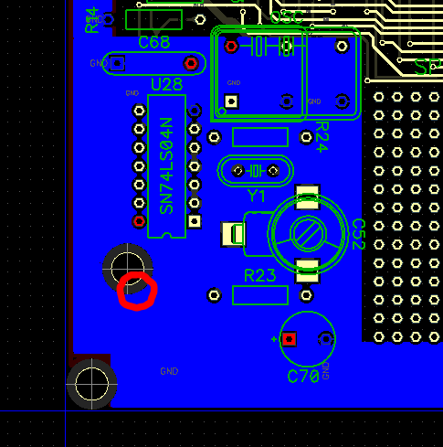
- Не правильный рисунок на шелке у транзистора Q3 2N3904. Транзистор следует устанавливать плоской частью к верху платы.   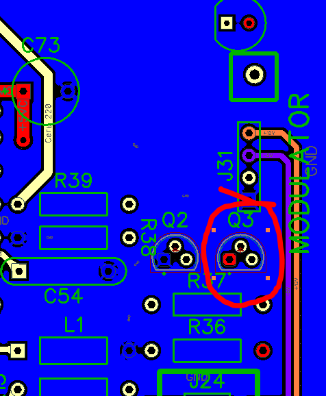
- У микросхемы зещелки U23 74LS374 необходимо расположить дополнительный конденсатор ~220пФ между первой ножкой и землей. Можно навесным монтажом, можно снизу платы используя SMD тип конденсатора.   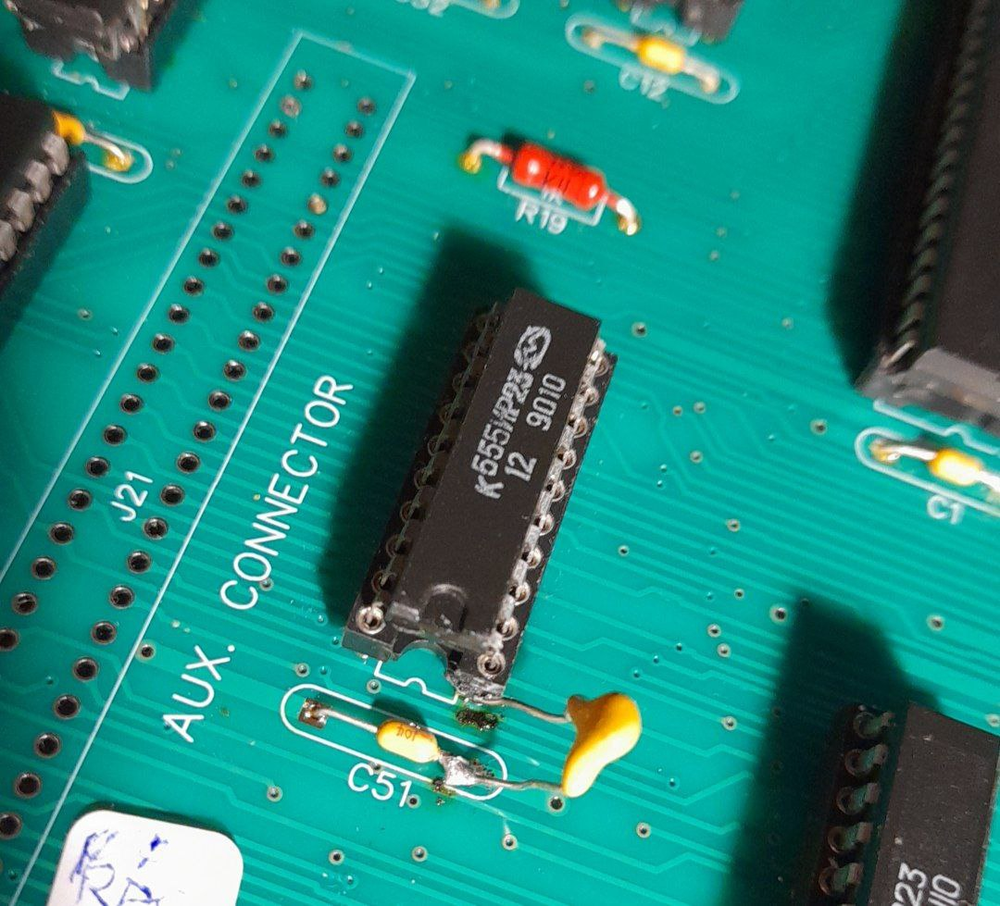
- Неправильно выбранная мной замена JK-триггера 74S109 в схеме делителя частоты на D-триггер типа 74(L)S74, микросхема U29. В результате чего цвета отображаются не правильно. Слева оригинальная схема Apple, справа примененная на плате схема:  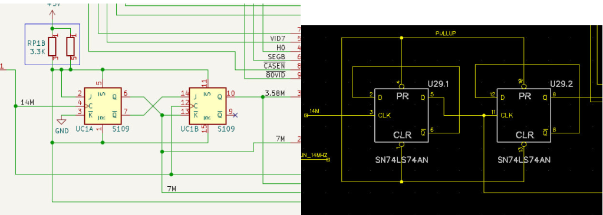 Кстати, свеже-отрисованная схема (кусок которой слева) так же содержит ошибку - прямой выход с первого триггера Q (6 нога) должен соединяться с входом J (14 нога) второго триггера, а инверсный выход /Q ( 7 нога ) должен соединяться с входом K (13 нога) второго триггера. Правильно эта схема нарисована в книге [Jim Sather - Understanding the Apple IIe](https://archive.org/details/Understanding_the_Apple_IIe) В итоге, 74S109 конечно не устанавливается в панельку для 74LS74, хотя бы потому что у них количество ножек разное. Ну и разумеется распиновка другая. Вариантов решения проблемы несколько: первое и простое, но не очень красивое - это воспользовался местом на плате с названием SPARE (небольшая макетка), куда можно запаять JK-тригер и снизу платы подпаять к нему провода МГТФ согласно схемы, U29 при этом разумеется не устанавливать.  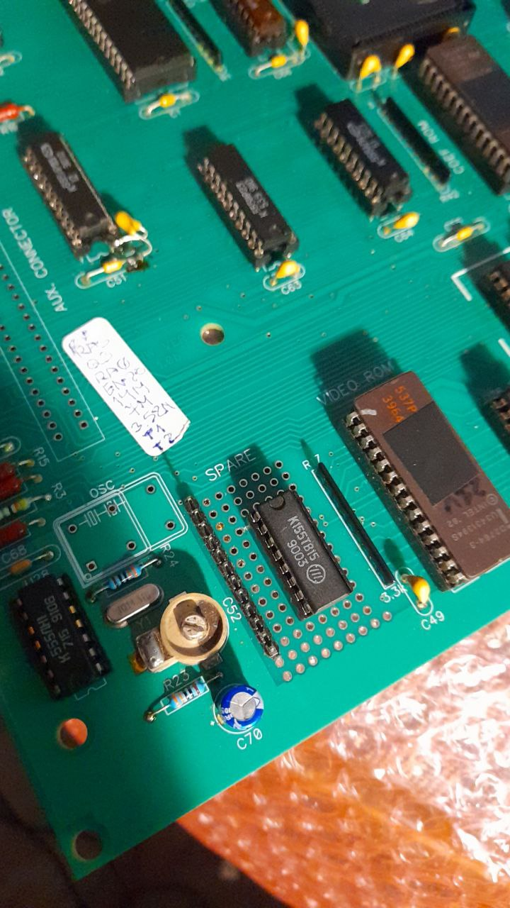  Второе решение - посложнее это все-таки установить 74S109 непосредственно на место 74LS74. Для этого необходимо загнуть (исключить контакт) и перекоммутировать некоторые ножки непосредственно под самой микросхемой 74S109 примерно таким образом: 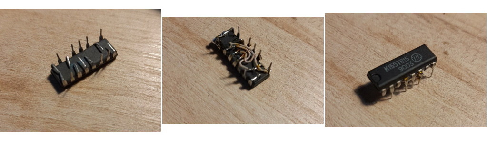 У микросхемы 74S109 загибаются ножки 1, 3, 7, 9, 12,13,14,16. Ножки 1 и 16 загнуты друг к другу и спаиваются между собой. К ним тонким проводом подпаивается отвод от незагнутой 15 ножки. Далее загнутая ножка 3 соединяется с незагнутой ножкой 8. Загнутая ножка 7 соединяется с загнутой ножкой 13. Загнутая ножка 9 никуда не подключается, так и остается просто загнута. Загнутая ножка 12 соединяется проводком с незагнутой ножкой 4. И наконец загнутая ножка 14 соединяется с незагнутой ножкой 6. Полученную "каракатицу" можно устанавливать в посадочное место U29 со сдвигом, так что бы 1 и 16 ножки висели в воздухе. Получается практически не заметно, без МГТФ снизу платы: 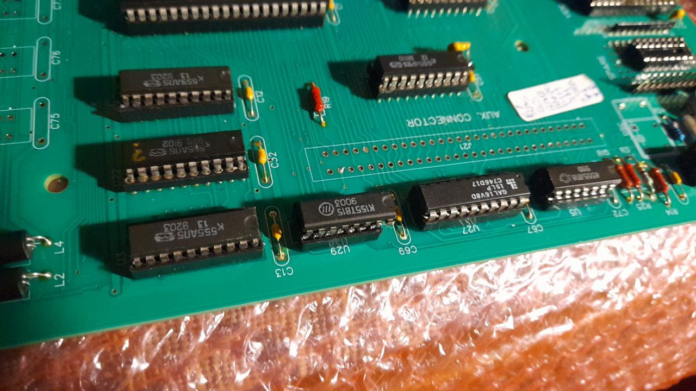

## Контактная информация
Задавать вопросы по сборке можно в телеграмм-канале https://t.me/appleiirus  
Новости по разработке этого и некоторых других проектов в личном блоге https://t.me/tronix_blog

