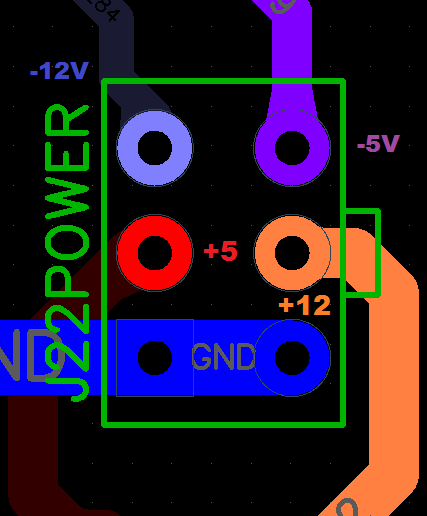
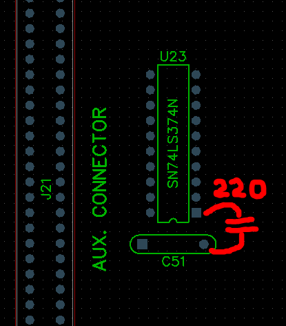

# О проекте клона совместимого компьютера с Apple IIe
Целью данного проекта является создание платы совместимого компьютера с Apple IIe с приближенной к оригиналу схемотехникой и размером платы. За референс при разработке была взята фотография материской платы Apple IIe NTSC (она справа)

Основные отличия от оригинальной схемы:
- вместо заказных ASIC (БМК) микросхем IOU и MMU в проекте используются CPLD фирмы Altera EPM7128SLC84;
- прямо на основную плату добавлены дополнительные 64Кб памяти, известные как Aux RAM/[Apple 80-Column Text Card](https://en.wikipedia.org/wiki/Apple_80-Column_Text_Card "Apple 80-Column Text Card");
- вместо двух микросхем типа 27C64 с основным ROM Apple IIe установлена одна микросхема типа 27C256, с возможность переключить верхний и нижний банк джампером. Это позволяет записать в одну микросхему ROM AppleIIe enhanced и тест оперативной памяти DeadTest, или записать обычный Apple IIe ROM и Apple IIe enhanced с возможность переключаться между ними; 
- на плате отсутствует какой-либо контроллер клавиатуры (в следствии отсутствия свободного места). Вместо этого предусмотрено место для установки разъема, в который сверху устанавливается дополнительная плата контроллера клавиатуры "бутербродом". На дополнительной плате клавиатурного контроллера располагается разъем для подключения оригинальной матричной клавиатуры Apple IIe;
- на плате присутствует разъем PS/2 для подключения PS/2 клавиатуры, однако без дополнительной платы клавиатурного контроллера он никуда не подключен;
- основной генератор переделан с транзисторной схемы на схему с использованием инвертера типа 74LS04 (555ЛН1), при этом предусмотрена возможность установить отдельный кварцевый генератор;
- операционный усилитель в схеме работы с магнитафоном заменен с двуполярного на однополярный, тем самым обеспечивая нормальное функционирование платы от однополярного источника питания плюс 5 вольт.
## Сборка платы
### Какая документация нужна для сборки
- При разработке платы я руководствовался свеже-отрисованной схемой [Apple IIe (NTSC) - 050-0051-D](https://github.com/baldengineer/bit-preserve/blob/main/Apple/Apple%20IIe/Apple%20IIe%20(NTSC)%20-%20050-0051-D/Apple%20IIe%20(NTSC)%20-%20050-0051-D.pdf "Apple IIe (NTSC) - 050-0051-D") от команды [bit-preserve](https://github.com/baldengineer/bit-preserve/tree/main/Apple/Apple%20IIe "bit-preserve") . Схема хорошо читается (в отличии от моей), полезно иметь ее под рукой для представления об оригинальной схемотехнике Apple IIe (а мы от нее не далеко отсупаем).
- Список деталей BOM на плату rev1.0b здесь: [.csv версия](pdfs/bom_rev1_0b.csv) [.ods OpenOffice версия](pdfs/bom_rev1_0b.ods)
- Монтажная схема расположения деталей на плату rev1.0b здесь: [монтажная схема rev1.0b](images/pcb_montag_rev1_0b.png)
- Схема принципиальная на плату rev1.0b здесь: [схема принципиальная rev1.0b](pdfs/circuit_rev1_0b.pdf)
- Книга "мурзилка" о внутреннем устройстве Apple IIe, с временными диаграммами, принципами функционирования MMU, IOU, памяти и многим другим: [Jim Sather - Understanding the Apple IIe](https://archive.org/details/Understanding_the_Apple_IIe) Если что-то пошло не так.

### Система питаний
Для полноценного функционирования платы необходим только один источник однополярного питания плюс 5 вольт. Остальные вспомогательные напряжения минус 5 вольт, минус 12 вольт, плюс 12 вольт основной платой не используются и разведены лишь на дополнительные слоты расширения (SLOT1-SLOT7). Конкретный тип используемого разъема питания в оригинальной плате AppleIIe мной не установлен, поэтому посадочное место сделано скорее под стандартный тип Molex разъема 6 пин, хотя отверстия и несколько увеличины в диаметре для возможной установки оригинального разъема (но не гарантируется). Распиновка соответствует оригинальной распиновке Apple IIe:

При этом пятивольтовая шина питания на плате разделяется на две - одна шина питает всю логику, память и вообще нижнюю часть платы. Другая же пятивольтовая шина питает слоты расширения и схему формирования видео-сигнала (видео-усилители). Так сделано в оригинальной Apple IIe, так же сделал и я. Поэтому важно при начальной сборке платы и запуске только от однополярного источника +5 вольт не забыть установить два дросселя L5 и L2 возле разъема питания для нормального функционирования обоих этих шин. Дроссели представляют из себя ферритовые бусины для гашения возможных высокочастотных помех от блока питания, и в случае современных качественных блоков питания и/или на период сборки-наладки их можно заменить на перемычки (в случае отсутствия нужных дросселей-фильтров).

### Приступая к сборке и опять про питание
Не смотря на кажущуюся простоту конструкции и небольшое количество микросхем, компьютер Apple IIe представляет из себя достаточно сложное устройство с жесткими привязками к таймингам, есть тактовые сигналы с обратной связью, что крайне затрудняет отладку "в динамике". Поэтому имеет смысл собирать плату поблочно, проверяя тот или иной узел после сборки и только после этого приступать к другому узлу. Начать следует с питания - необходимо определиться, планируется ли использования в дальнейшем каких-либо карт расширения, использующих кроме основного питания пять вольт дополнительные линии питания плюс 12 вольт, минус 12 вольт и минус пять вольт. Если планируется, то необходимо будет распаивать все дросселя-фильтры на каждые шины питаний, устанавливать все электролитические и фильтрующие конденсаторы по этим линиям. Если не планируется, то можно обойтись одним лишь однополярным блоком питания 5 вольт и не распаивать фильтрующие конденсаторы по дополнительным линиям питаний. А конкретно это дроссель L6 и керамические конденсаторы C89 - C95 (7 штук) 0.1мкФ по линии -12 вольт; дроссель L3, конденсаторы C96 - C102 (7 штук) 0.1мкФ и электролит C71 по линии -5 вольт; дроссель L4 и конденсаторы C75 - C81 (7 штук) 0.1мкФ по линии +12 вольт. Не лишним будет начать сборку именно с установки всех фильтрующих конденсаторов 0.1мкФ по линиям питания пять вольт (порядка 90 штук в общей сложности). Так как плата двухслойная без внутренних слоев питания и земли, без блокировочных конденсаторов на плате могут появляться нежелательные шумы по питанию.

### Первые шаги
После того, как на плату можно подавать питание, например от лабораторного блока питания

### Errata или уже найденные ошибки на плате rev1.0b
- Отверстие под стойку в нижнем левом углу платы чуть-чуть не совпадает с расположением стойки в корпусе 2e. Нужно буквально на миллиметр расположить его ниже и правее?. Можно без проблем рассверлить до большего диаметра, так как никаких дорожек рядом не проходит. 
- Не правильный рисунок на шелке у транзистора Q3 2N3904. Транзистор следует устанавливать плоской частью к верху платы. 
- У микросхемы зещлки U23 74LS374 необходимо расположить дополнительный конденсатор ~220пФ между первой ножкой и землей. Можно навесным монтажем, можно снизу платы используя SMD тип конденсатора.  
- Неправильно выбранная мной замена JK-триггера 74S109 в схеме делителя частоты на D-триггер типа 74(L)S74, микросхема U29. В результате чего цвета отображаются не правильно. Слева оригинальная схема Apple, справа примененная на плате схема:   Кстати, свеже-отрисованная схема (кусок которой слева) так же содержит ошибку - прямой выход с первого триггера Q (6 нога) должен совединятся с входом J (14 нога) второго триггера, а инверсный выход /Q ( 7 нога ) должен соединятся с входом K (13 нога) второго триггера. Правильно эта схема нарисована в книге [Jim Sather - Understanding the Apple IIe](https://archive.org/details/Understanding_the_Apple_IIe) В итоге, 74S109 конечно не устанавливается в панельку для 74LS74, хотя бы потому что у них количество ножек разное. Ну и разумеется распиновка другая. Вариантов решения несколько: первое и простое, но не очень красивое - это воспользовался местом на плате с названием SPARE (небольшая макетка), куда можно запаять JK-тригер и снизу платы подпаять к нему провода МГТФ согласно схемы, U29 при этом разумеется не устанавливать.  Второе решение - посложнее - это все-таки установить 74S109 непосредственно на место 74LS74. Для этого необходимо загнуть (исключить контакт) и перекоммутировать некоторые ножки непосредственно под самой микросхемой 74S109 примерно таким образом:  У микросхемы 74S109 загибаются ножки 1, 3, 7, 9, 12,13,14,16. Ножки 1 и 16 загнуты друг к другу и спаиваются между собой. К ним тонким проводом подпаивается отвод от 15 ножки. Далее загнутая ножка 3 соединяется с незагнутой ножкой 8. Загнутая ножка 7 соединяется с загнутой ножкой 13. Загнутая ножка 9 никуда не подключается, так и остается просто загнута. Загнутая ножка 12 соединяется проводком с незагнутой ножкой 4. И наконец загнутая ножка 14 соединяется с незагнутой ножкой 6. Полученную "каракатицу" можно устанавливать в посадочное место U29 со сдвигом, так что бы 1 и 16 ножки висели в воздухе. Получается практически не заметно и без МГТФ снизу платы: 
